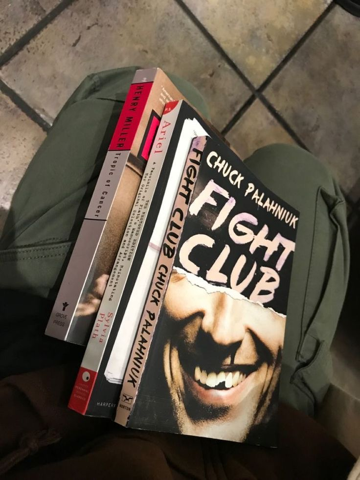

<table border="0" cellpadding="0" cellspacing="0">
<tr>
<td width="38%" valign="top" style="padding: 0;">
  
</td>
<td width="62%" valign="top" style="padding: 20px 0 0 28px;">

**Lucas Madureira**  
computer science student · software developer · security enthusiast

dev working with typescript, react and next.js — building full-stack applications focused on performance and clean architecture. transitioning into cybersecurity, with focus on the offensive side, cloud hardening and secure systems design. founder of [@amazonext](https://github.com/amazonext), where i build and ship real products.

i got into programming because i wanted to understand how things work under the hood. now i want to understand how they break.

— stack: typescript · react · next.js · node.js · python · bash · linux · docker · aws · postgresql  
— focus: offensive security · tryhackme · hackthebox · aws security · iam hardening · rust · systems programming  
— certs: introduction to the threat landscape 3.0 (fortinet, 2026) · introduction to cybersecurity (cisco, 2026)

[linkedin](https://www.linkedin.com/in/lucasblackstar/) · [gmail](mailto:jmadureira00@gmail.com)

</td>
</tr>
</table>
