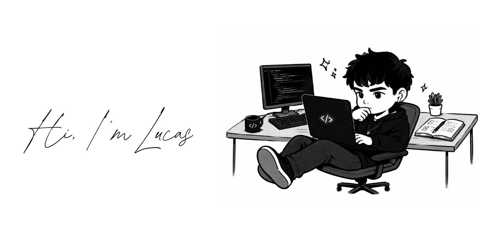

---

Hi there, I'm Lucas! I'm a Computer Science student (B.Sc. in progress) currently working as a full-stack developer in the public sector([**SEDUC-PA**](https://github.com/FADEP-PA)). Alongside engineering, I focus on secure systems design and offensive security tooling, aiming to build robust, type-safe architecture that powers reliable government infrastructure.

## Current Focus

- **Production Systems:** Building and maintaining internal platforms at SEDUC-PA — civil servant evaluation, public hiring processes, and the statewide school census.
- **Secure Systems Design:** Type-safe architecture, threat modeling, and hardening across the stack.
- **Offensive Security Tooling:** Developing recon and WAF tooling in Go and Rust.

## Stack

  

## Projects

- **gospector** — Go recon toolkit using certificate transparency
- **waf-proxy** — Rust reverse proxy with a Lua-based WAF engine (SQLi/XSS detection)

## Certifications

- Threat Landscape 3.0 — **Fortinet** · 2026
- Introduction to Cybersecurity — **Cisco** · 2026

---

Brazil · <a href="https://joao-madureira.vercel.app">portfolio</a>